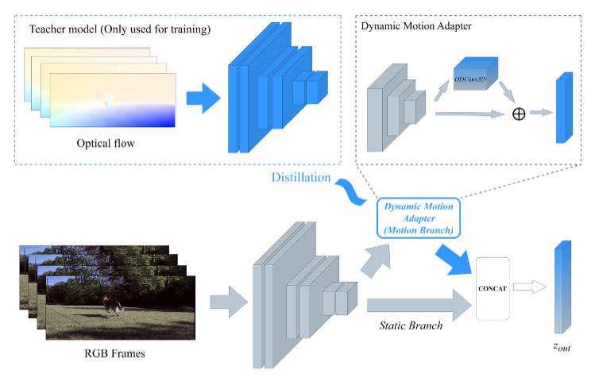
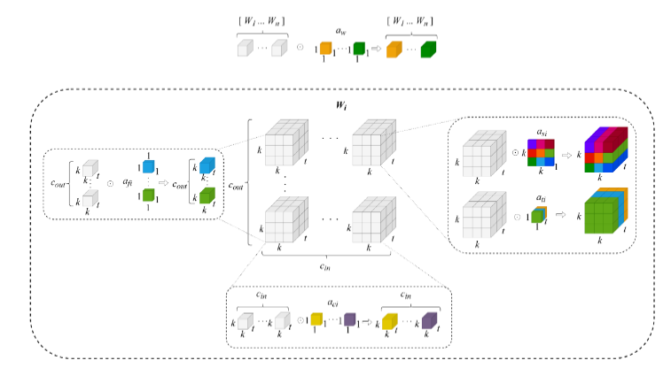

# 🍰 CAKE: Cross-modal Action Knowledge Estimation for Online Action Detection

[](https://pytorch.org/)
[](LICENSE)
[]()

> **Bachelor Thesis in Computer Science – Hanoi University of Science and Technology**  
> **Author:** Hoang Minh Hieu  

---

## 📖 Introduction

**CAKE (Cross-modal Action Knowledge Estimation)** is a novel framework designed for **Online Action Detection (OAD)** on edge devices.

CAKE addresses the critical trade-off between **Inference Speed** and **Accuracy**. Instead of relying on computationally expensive Optical Flow computation during inference, CAKE employs a **Split-Branch Architecture** equipped with **ODConv3D** to *hallucinate* motion features directly from RGB inputs. Furthermore, the framework tackles the background ambiguity problem in untrimmed videos via a novel **Floating Contrastive Learning** mechanism.

### ✨ Key Features
- **Zero-Flow Inference:** Achieves accuracy comparable to Two-Stream networks (72.0% mAP on THUMOS'14) using **RGB only**.
- **Real-time on Edge:** Inference speed of **72.8 FPS** on CPU and **>100 FPS** on GPU, powered by the lightweight X3D backbone.
- **Motion Hallucination:** Integrates a **Dynamic Motion Adapter (DMA)** using ODConv3D to mimic Optical Flow attention patterns.
- **Floating ConPro:** A novel contrastive learning strategy to effectively handle the unstructured diversity of the background class.

---

## 🧠 Methodology

### 1. Overall Framework: Split-Branch Distillation

CAKE is designed to operate on **RGB-only inputs** during inference while retaining the motion-awareness of Two-Stream architectures. We propose a **Split-Branch Architecture**, where the backbone is divided into two parallel streams:

- **Static Branch:** Uses standard 3D convolutions to extract appearance and contextual features (spatial semantics).
- **Dynamic Motion Adapter (DMA):** Replaces standard convolutions with **ODConv3D** to model temporal dynamics.

During training, CAKE employs a **Cross-modal Knowledge Distillation** strategy. A Teacher network, pre-trained using Optical Flow, guides the Student’s DMA branch to hallucinate motion features from static RGB frames.



*Figure 1: Overview of the proposed CAKE framework. The Student network (bottom) learns to mimic the Optical Flow Teacher (top) via the Dynamic Motion Adapter, effectively encoding motion knowledge into an RGB-only backbone.*

---

### 2. Core Engine: Omni-dimensional Dynamic Convolution (ODConv3D)

To enable motion hallucination, CAKE integrates **ODConv3D** inside the DMA module. Unlike standard dynamic convolutions that attend to a single dimension, ODConv3D applies attention across multiple kernel dimensions.

Specifically, it computes four types of attentions  
$\alpha_{si}, \alpha_{ci}, \alpha_{fi}, \alpha_{wi}$

corresponding to **spatial size**, **input channels**, **output channels**, and **expert kernels**, respectively.



*Figure 2: Structure of ODConv3D. The convolution kernel is dynamically re-weighted based on the input features, allowing the network to adaptively focus on moving boundaries while suppressing static background noise.*

---

## 🗂️ Data Preparation

Please download the datasets and organize them under the `data/` directory.

### Directory Structure
```
data/
├── kinetics400/
│ ├── train_videos/
│ ├── val_videos/
│ └── annotations/
├── thumos14/
│ ├── frames/ # Extracted frames (30 FPS)
│ ├── flow/ # (Optional) Optical Flow for Teacher training
│ └── annotations/
└── tvseries/
├── frames/
└── annotations/
```


---

### 1. Kinetics-400 (Pre-training)

Kinetics-400 is used to pre-train the video backbone.

- **Download:** Use the official [CVDF Kinetics crawler](https://github.com/cvdfoundation/kinetics-dataset) or ActivityNet tools.
- **Note:** If you only want to evaluate OAD performance, this step can be skipped by downloading our **pre-trained checkpoints**.

---

### 2. THUMOS'14

- **Download:** Available at the official [THUMOS Challenge website](http://crcv.ucf.edu/THUMOS14/download.html).
- **Preprocessing:**
  - Extract RGB frames at **30 FPS**.
  - *(Optional)* Extract Optical Flow using TV-L1 or RAFT for Teacher model training.
  - Place annotation files (e.g., `test_Annotation.txt`) in `thumos14/annotations/`.

---

### 3. TVSeries

- **Download:** This dataset targets realistic, unconstrained scenarios. Please request access from  
  [De Geest et al., ECCV 2016](https://homes.esat.kuleuven.be/psi-archive/rdegeest/TVSeries.html).
- **Preprocessing:** Extract RGB frames at **30 FPS**, following the same protocol as THUMOS'14.

---

## 📊 Benchmark Results

### THUMOS'14 (Online Action Detection)

The following table compares **CAKE** with state-of-the-art Online Action Detection methods on **THUMOS'14**.

To ensure a **fair comparison**, **CAKE-R50** follows the same **two-stream pipeline** as prior SOTA methods, using **ResNet-50 for RGB** and **BN-Inception for TV-L1 Optical Flow**.  
In contrast, **CAKE-X3D** demonstrates a lightweight **RGB-only** configuration designed for real-time edge deployment.

| Method | Backbone | Params (Backbone) [M] | Params (Head) [M] | Params (Total) [M] | GFLOPs | mAP (%) |
|------|---------|-----------------------|-------------------|--------------------|--------|---------|
| RED (2020) | – | – | – | – | – | 45.3 |
| LAP (2016) | – | – | – | – | – | 53.3 |
| TFN (2019) | – | – | – | – | – | 55.7 |
| FATS (2022) | – | – | – | – | – | 59.0 |
| IDN (2018) | – | – | – | – | – | 60.3 |
| TRN (2017) | ResNet-200 + BN-Inception | 76.0 | 402.9 | 478.9 | 18.52 | 62.1 |
| PKD (2020) | – | – | – | – | – | 64.5 |
| OadTR (2021) | ResNet-200 + BN-Inception | 76.0 | 75.8 | 151.8 | 19.60 | 65.2 |
| Colar (2022) | – | – | – | – | – | 66.9 |
| WOAD (2021) | Two-Stream I3D | 25.0 | 110.0 | 135.0 | – | 67.1 |
| FCRL (2022) | – | – | – | – | – | 68.3 |
| LSTR (2021) | ResNet-50 + BN-Inception | 36.8 | 58.0 | 94.8 | 13.68 | 69.5 |
| GateHUB (2022) | ResNet-50 + BN-Inception | 36.8 | 45.2 | 82.0 | 13.13 | 70.7 |
| TeSTra (2022) | ResNet-50 + BN-Inception | 36.8 | 58.9 | 95.7 | 10.52 | 71.2 |
| MALT (2024) | ResNet-50 + BN-Inception | 36.8 | – | – | – | 71.4 |
| MiniROAD (2023) | ResNet-50 + BN-Inception | 36.8 | **15.8** | 52.6 | 6.17 | 71.4 |
| **CAKE-R50 (Ours)** | ResNet-50 + BN-Inception | 36.8 | **15.8** | 52.6 | 6.17 | **72.0** |
| **CAKE-X3D (Ours)** | **X3D (RGB only)** | **3.5** | 17.5 | **21.0** | **4.00** | 67.1 |

---

### TVSeries (Real-world Online Action Detection)

We further evaluate CAKE on **TVSeries**, which represents **long, untrimmed, real-world videos** with complex background dynamics.  
The metric used is **mcAP**.

| Method | Backbone | Params (Backbone) [M] | Params (Head) [M] | Params (Total) [M] | GFLOPs | mcAP (%) |
|------|---------|-----------------------|-------------------|--------------------|--------|----------|
| RED (2020) | – | – | – | – | – | 79.2 |
| FATS (2022) | – | – | – | – | – | 84.6 |
| TFN (2019) | – | – | – | – | – | 85.0 |
| LAP (2016) | – | – | – | – | – | 85.3 |
| IDN (2018) | – | – | – | – | – | 86.1 |
| TRN (2017) | ResNet-200 + BN-Inception | 76.0 | 402.9 | 478.9 | 18.52 | 86.2 |
| PKD (2020) | – | – | – | – | – | 86.4 |
| OadTR (2021) | ResNet-200 + BN-Inception | 76.0 | 75.8 | 151.8 | 19.60 | 87.2 |
| Colar (2022) | – | – | – | – | – | 88.1 |
| FCRL (2022) | – | – | – | – | – | 88.4 |
| LSTR (2021) | ResNet-50 + BN-Inception | 36.8 | 58.0 | 94.8 | 13.68 | 89.1 |
| GateHUB (2022) | ResNet-50 + BN-Inception | 36.8 | 45.2 | 82.0 | 13.13 | **89.6** |
| MiniROAD (2023) | ResNet-50 + BN-Inception | 39.2 | **15.8** | 55.0 | 6.17 | **89.6** |
| **CAKE-X3D (Ours)** | **X3D (RGB only)** | **3.5** | 17.5 | **21.0** | **4.00** | 86.5 |


---

## 👁️ Qualitative Visualization

Visualization of CAKE’s motion hallucination on the *Feeding Birds* sequence:


*The last row shows that CAKE (via DMA) accurately focuses on the motion of the birds and the hand, closely matching the Optical Flow Teacher, while the standard RGB model is distracted by static background regions.*

---

## 🛠️ Installation

### Requirements
- Linux / Windows
- Python 3.8+
- PyTorch 1.10+
- CUDA 11.3 (recommended)

### Setup

```bash
git clone https://github.com/username/CAKE-OAD.git
cd CAKE-OAD
pip install -r requirements.txt
```

## ⚙️ Backbone Training (Motion Distillation Stage)

The backbone training is implemented in `cake/train.py`.  
This stage focuses on **cross-modal motion distillation**, where the RGB student backbone learns motion-aware representations from an Optical Flow teacher.

Below is a detailed explanation of all training configurations.

---

### 📁 Paths & Weights

| Argument | Description |
|--------|-------------|
| `--train_list` | Path to the training video list file (e.g., Kinetics-400 or THUMOS split). |
| `--train_root` | Root directory containing training videos or extracted frames. |
| `--val_list` | (Optional) Path to the validation video list. |
| `--val_root` | (Optional) Root directory for validation data. |
| `--raft_weights` | Pretrained **RAFT** weights used for Optical Flow extraction during teacher supervision. |
| `--flow_teacher_weights` | Pretrained Optical Flow **Teacher network** checkpoint. |
| `--student_pretrained` | (Optional) Pretrained RGB backbone weights for the student (e.g., Kinetics-400). |
| `--resume` | Resume training from an existing checkpoint. |

---

### 🔧 Training Parameters

| Argument | Default | Description |
|--------|---------|-------------|
| `--save_dir` | `./checkpoints_k400` | Directory to save checkpoints and logs. |
| `--epochs` | `30` | Number of training epochs. |
| `--batch_size` | `16` | Batch size per GPU. |
| `--clip_len` | `13` | Number of frames per video clip. |
| `--workers` | `8` | Number of data loading workers. |
| `--lr_backbone` | `1e-4` | Learning rate for pretrained backbone layers. |
| `--lr_new_layers` | `1e-3` | Learning rate for newly added layers (DMA, projection heads). |

---

### ⏱️ Temporal Sampling Configuration

| Argument | Default | Description |
|--------|---------|-------------|
| `--stride` | `6` | Temporal sampling stride between consecutive frames. Larger values increase temporal coverage while keeping computational cost fixed. |

This configuration allows CAKE to model **long-range motion patterns** efficiently without increasing clip length.

---

### 🎓 Distillation Configuration

| Argument | Default | Description |
|--------|---------|-------------|
| `--distill_type` | `mgd` | Type of distillation loss used for motion transfer. Supported options: <br>• `mgd` – Masked Generative Distillation (default) <br>• `mse` – Mean Squared Error <br>• `embed` – Embedding-level supervision <br>• `cosine` – Cosine similarity loss |
| `--alpha_distill` | `1.0` | Weight of the distillation loss term. |

---

### ❄️ Backbone Freezing Option

| Argument | Description |
|--------|-------------|
| `--freeze_rgb` | If enabled, freezes the RGB backbone and trains only the Dynamic Motion Adapter (DMA) and distillation layers. |

This option is useful for:
- Fast adaptation
- Low-resource training
- Ablation studies on motion hallucination capacity

---

### ▶️ Example Command (Kinetics-400 Pretraining)

```bash
python cake/train.py \
  --train_list data/kinetics400/train_list.txt \
  --train_root data/kinetics400/train_videos \
  --raft_weights pretrained/raft.pth \
  --flow_teacher_weights pretrained/flow_teacher.pth \
  --save_dir checkpoints_k400 \
  --epochs 30 \
  --batch_size 16
```
### 📌 Notes

- Optical Flow is only used during training for distillation.

- During inference, CAKE operates in RGB-only mode, without RAFT or Flow Teacher.

- This backbone training corresponds to Stage 1 (Motion Distillation) in the full CAKE training pipeline.

### 🙏 Acknowledgement

This project builds upon the following foundational works:
- [X3D: Expanding Architectures for Efficient Video Recognition](https://github.com/facebookresearch/SlowFast)

- [MiniROAD: Minimal Recurrent Online Action Detection](https://github.com/jbistanbul/MiniROAD.git)

- [ODConv: Omni-Dimensional Dynamic Convolution](https://github.com/OSVAI/ODConv)
